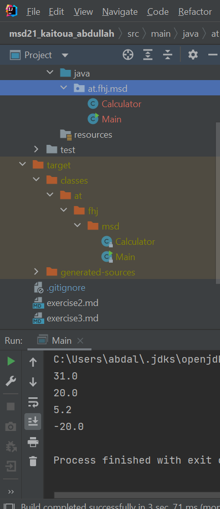

# Exercise 3

my first maven project.

- I installed maven
- I installed JRE and JDK
- set JAVA_HOME und PATH variable
- check the versions
```bash
mvn -v
```

```bash
java -v
```

```bash
javac -v
```

- I made new maven project with Intellij in the repository
- I made new markdown file exercise3.md 
- I wrote a java program with the class Calculator.java for calculation
and  main class Main.java. to make some Calculation
- After executing the main, we get target folder .. include classes in the packages and generated sources and maven source(see screenshot)
  

- edit pom.xml
- I built in the console the demo program.
```bash
mvn compile
```
- executing main class in the console (see screenshot)
  


 