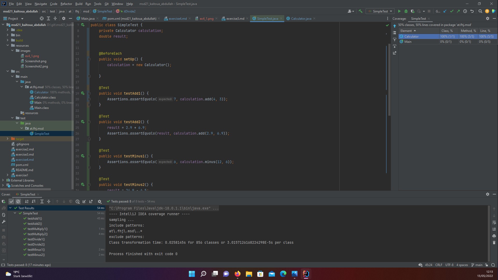

- i made sure  that target folder, .idea ,build folder , ... are hidden
- create folder resources and subfolder images and move the screenshoots to it
- <project.build.sourceEncoding>UTF-8</project.build.sourceEncoding>
- <plugin><artifactId>maven-surefire-plugin</artifactId>
<version>2.22.1</version>
</plugin>
-actual  version with strg+space

- <dependencies>
<dependency>
<groupId>org.junit.jupiter</groupId>
<artifactId>junit-jupiter-api</artifactId>
<version>5.8.2</version>
Konfig Uebung04 - Source Code Testen.docx Seite 4 von 9
Institut Internettechnologien und -Anwendungen
<scope>test</scope>
</dependency>
<dependency>
<groupId>org.junit.jupiter</groupId>
<artifactId>junit-jupiter-engine</artifactId>
<version>5.8.2</version>
<scope>test</scope>
</dependency>
<dependency>
<groupId>org.junit.jupiter</groupId>
<artifactId>junit-jupiter-params</artifactId>
<version>5.8.2</version>
<scope>test</scope>
</dependency>
</dependencies>

-after copying the previous dependencies download via click button 
- creat at.fhi.msd package in test folder
- create SimpleTest
- create object of the class calculation and variable result
- create @BeforeEach  and setUp() method and initialize a new object to create before each test a new object
- create two test cases for each method (add, minus,divide ,multiply) : 
1. comparing with direct result
2. comparing with the operation in the result variable

-Test coverage :right click on More Run/Debug -> Run ... with coverage
indicate how many parts of the source code have been tested
   

