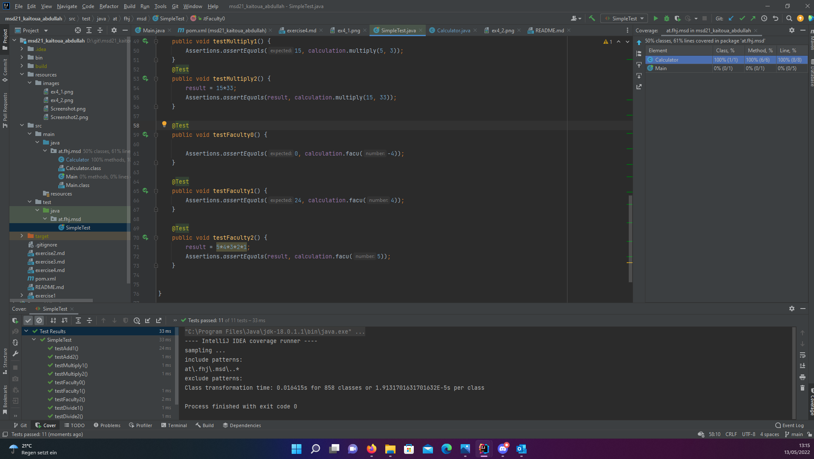

- i made sure  that target folder, .idea ,build folder , ... are hidden
- create resources folder  and subfolder images and move the screenshoots to it
- add the properties in pom.xml
-actual  version via strg+space
- creat at.fhi.msd package in test folder
- create SimpleTest
- create object of the class calculation and variable result
- create @BeforeEach  and setUp() method and initialize a new object to create before each test a new object
- create two test cases for each method (add, minus,divide ,multiply) : 
1. comparing with direct result
2. comparing with the operation in the result variable

-Test coverage :right click on More Run/Debug -> Run ... with coverage
indicate how many parts of the source code have been tested

## 2 Testcases for each (Add,Minus,Divide und Multiply) 

   
## Faculty counter faild

## Faculty counter succeed

## MVN TEST

