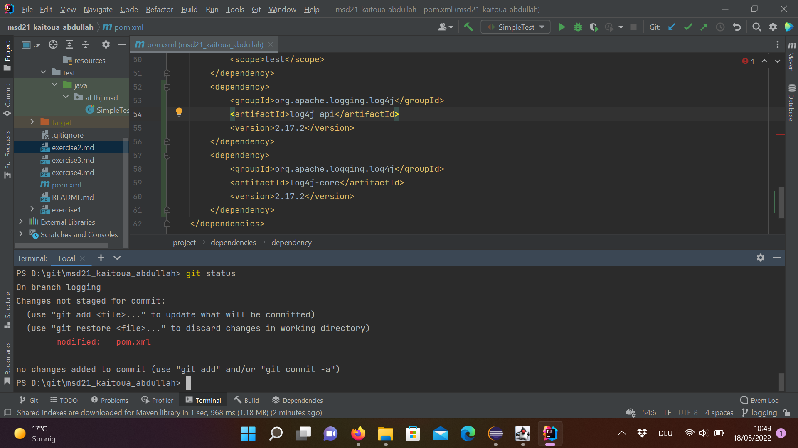
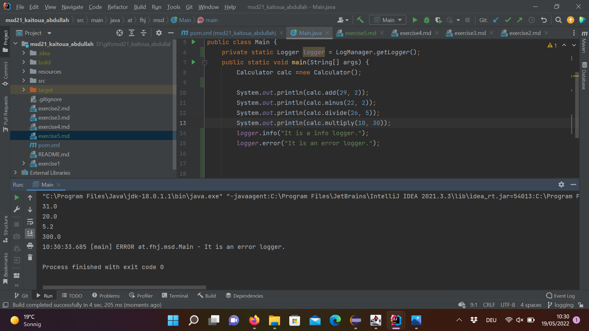
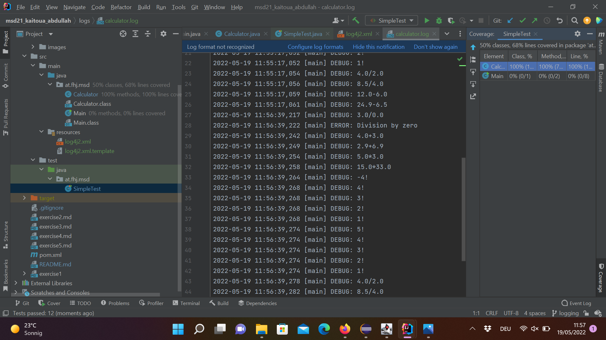

# Exercise 5
-create a new branch logging via git branch 
-Switch to the logging branch via git checkout

##ex5-1

##ex5.2

-Create Maven project with Log4j2 dependency
-Obtain a Logger
-Use INFO and ERROR levels to log 
-by default Log4j assigns the root logger to Level.ERROR and those logs will be printed on the standard console. 
-ALL < TRACE < DEBUG < INFO < WARN < ERROR < FATAL
So since the default level is set to ERROR, error  will be logged.

##ex5.3

