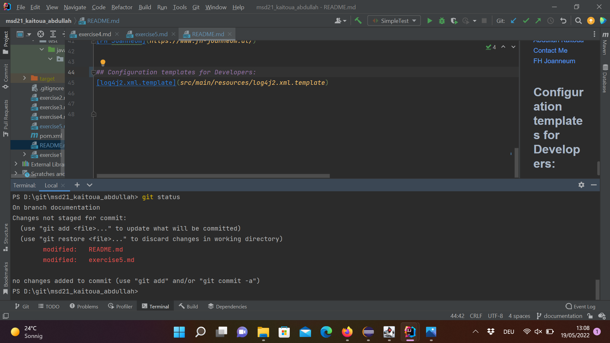

# Exercise 5

-create a new branch logging via git branch 
-Switch to the logging branch via git checkout

##ex5-1

##ex5.2

-Create Maven project with Log4j2 dependency
-Obtain a Logger
-Use INFO and ERROR levels to log 
-by default Log4j assigns the root logger to Level.ERROR and those logs will be printed on the standard console. 
-ALL < TRACE < DEBUG < INFO < WARN < ERROR < FATAL
So since the default level is set to ERROR, error  will be logged.

##ex5.3

##ex5.4

### why we use Logging ?
if we run test, we can track the failure from log data, because log contains when the test failed where and why? according to the log level
In short: logs will be very important for development, testing, and finding the place of occurrence of a problem later.
### Which Loglevel are there in Log4J and what for we use each?
Levels used for identifying the severity of an event.
Log4j follows this order : ALL < TRACE < DEBUG < INFO < WARN < ERROR < FATAL
    ALL : To log all events.
    DEBUG : A general debugging event.
    ERROR : An error in the application, possibly recoverable.
    FATAL : A severe error that will prevent the application from continuing.
    INFO : An event for informational purposes.
    TRACE : A fine-grained debug message, typically capturing the flow through the application.
    WARN : An event that might possibly lead to an error.
    OFF : No events will be logged. 
### which configuration possibilities has  log4J?
-default
-Automatic configuration 
-Additivity

